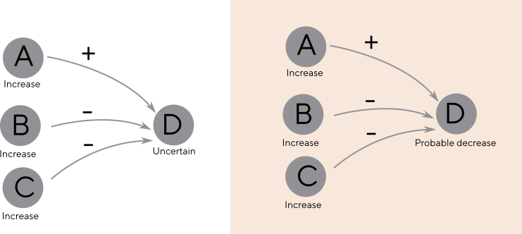

# How the data is passed through the network

## 1. Positive and negative correlation

Examples:

On the left: A rise in rainfall (A) *increases* the happiness of ducks (B), therefore a fall in rainfall (A) *decreases* the happiness of ducks (B).

On the light: A rise in temperature (A) *reduces* size of icecaps (B), therefore a fall in temperature (A) *increases* the size of icecaps (B).

## 2. Chaining together impacts

Examples:

* Increase in rainfall (A) leads to more ducks (B), decreasing the amount of bread (C).
* Decrease in rainfall (A) leads to less ducks (B), increasing the amount of bread (C).

## 3. Adding together impacts

Here we start to see uncertainty happening, where an increase or decrease contradict each other.

## 4. Uncertainies lead to more uncertainty

Once we have an uncertain increase/decrease, all following impacts become uncertain.

## 5. Reducing uncertainty

Ceren's idea was to all this uncertainty to be reduced by adding probable increase/decrese (this is not done yet, but it can be added!):
    

The majority of inputs indicate a decrease.

## 6. Questions

1. Can we use this to convert a previously uncertain state into a probable one?
2. What should we do if we need to add together a probable state with a certain one?
