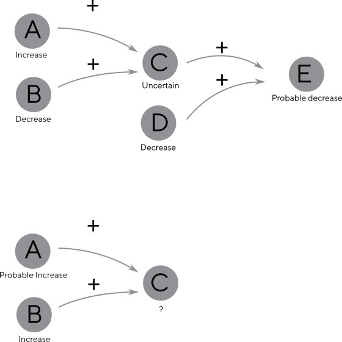

# How the climate data for region is currently passed through the network

This document explains how impacts are calculated around the network
of mDPSEEA nodes, from climate variables to health impacts. This is
currently under development, and fairly simple to modify so the
initial goal is to make sure we are doing this correctly, after which
it can be used as documentation.
    
## 1. Positive and negative correlation

Some assumptions (are these actually correct!):

* Climate variables (Pressures) can increase or decrease for a region
  selected by the user (we are not using thresholds or magnitudes).
* The States, Exposures and Effects they are connected to also
  increase or decrease.
* We can calculate these changes by using the connections between them
  (from the scientific evidence) as positive or negative correlations.
* The networks below could include Drivers, Pressures, States, Effects
  or Actions - they are all treated the same way.
    
Examples:
        

On the left are positive correlations, where the increases/decreases
match: An increase in rainfall in this area (A) *increases* the
happiness of ducks (B), therefore underneath, a decrease in rainfall
elsewhere (A) *decreases* the happiness of ducks (B).

On the right are negative correlations, where they are inverted: A
rise in temperature (A) *decreases* the time it takes for ice cream to
melt in this area (B), therefore a fall in temperature (A) *increases*
melting time (B).

## 2. Chaining together impacts

Impacts can be chained together simply matching rise/fall (+) or
inverting (-) each other.

Examples:

* Increase in rainfall (A) leads to more ducks (B), decreasing the amount of bread (C).
* Decrease in rainfall (A) leads to less ducks (B), increasing the amount of bread (C).

## 3. Multiple connections coming into an impact

When multiple connections come into an impact we need to check that
they agree. Agreement is dependant on whether the upstream impact is
increasing or decreasing in combination with the correlation being
positive or negative.
    

If the result disagrees we can't be certain whether the impact is
increasing or decreasing (worth noting that so far in the data we have
this only occurs once).

## 4. Uncertainies lead to more uncertainty

Once we have an uncertain increase/decrease, all following impacts
have to become uncertain too.

## 5. Ways to reduce uncertainty

Originally we talked about reducing this uncertainty by adding two
more states: probable increase/decrese (this is not done yet, but it
can be added). The inputs "vote" to indicate a majority decrease. This
does not solve a 50/50 split of course, so uncertainties are still
possible, *and it assumes the confidence and impact size is equal for
each connection*.
    

## 6. Future cases I'm not sure how do deal with

1. Should we use "probable" to add certainty to a previously uncertain state?
2. What should we do if we need to add together a probable state with a certain one?

